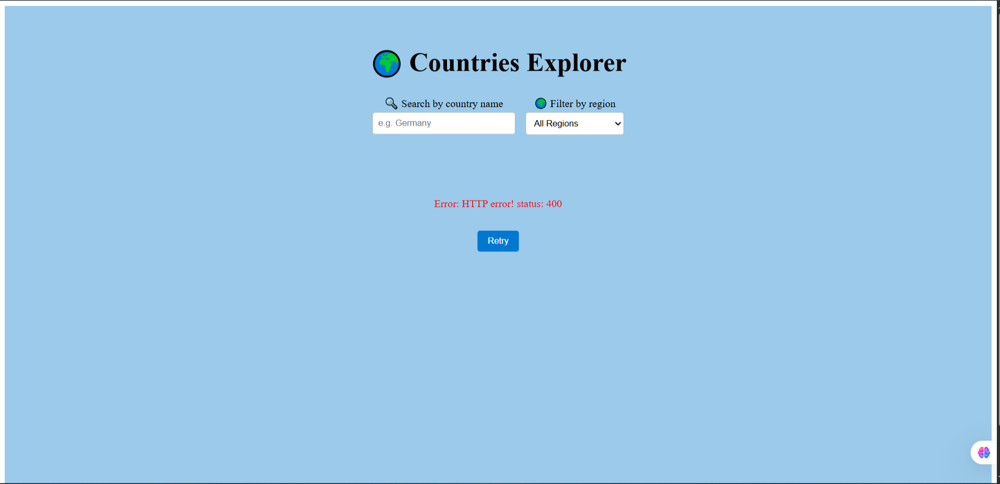
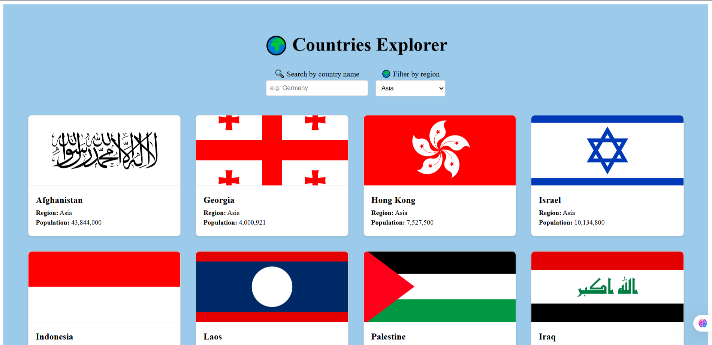

# Countries Explorer

A modern, responsive React app that lets users explore countries using the REST Countries API. Users can search by country name and filter by region all with a clean, minimal design.

## How to Run

1. Clone the repository:
   ```bash
   git clone https://github.com/FatemaAhm4di/countries-explorer.git

2. Install dependencies:

   cd countries-explorer
   
   npm install

3. Start the development server:
   
   npm run dev

5. Open your browser at the URL shown in the terminal (usually http://localhost:5173).
API Endpoints Used
All countries: https://restcountries.com/v3.1/all
⚠️ Note: As of February 2026, the endpoints /v3.1/name/{name} and /v3.1/region/{region} return "Page Not Found".
This app fetches all countries once from /all, then performs client-side filtering for search and region ensuring full functionality despite API changes.


     →

     → 
